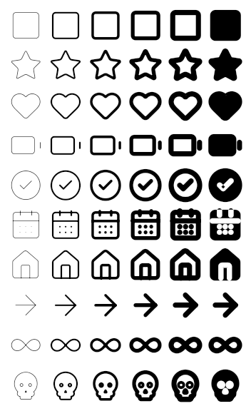

# Variable Font Generator

A Dart tool that turns a directory of SVG icons into a **variable** OpenType
icon font, and writes the Flutter bindings for it.

The generated font responds to the four axes Flutter's `Icon` widget already
drives — `fill`, `weight`, `grade` and `opticalSize` — so one file covers what
would otherwise be a family of them.

<!-- Weight, grade and optical size moving together, then the same again with
     the fill closed, drawn by Flutter from the generated font. It is a
     checked-in golden test. -->


## Layout

| | |
| --- | --- |
| [`packages/variable_font_generator`](packages/variable_font_generator) | the tool, as a pure Dart package |
| [`packages/lucide_variable_icons`](packages/lucide_variable_icons) | 45 Lucide icons built by it, with Flutter golden tests |
| [`action.yml`](action.yml) | the reusable GitHub action, which is this repository |
| [`tool/build_binary.sh`](tool/build_binary.sh) | compiles the tool into a single executable |
| [`tool/verify_font.py`](tool/verify_font.py) | checks a font against fontTools, FreeType, resvg, HarfBuzz and the OpenType Sanitizer |
| [`tool/check_tree_shaking.sh`](tool/check_tree_shaking.sh) | checks that a release build keeps exactly the icons it draws |

Start with the [package README](packages/variable_font_generator/README.md) —
it covers installation, the command line, how the axes are realised, and the
limitations.

## Quick start

```sh
cd packages/variable_font_generator
dart pub get
dart run bin/variable_font_generator.dart build ../../my-icons \
  --output ../../build/my_icons --family MyIcons
```

## In GitHub Actions

This repository is a reusable action. Point it at a directory of SVG files and
it writes the font, and the Flutter bindings if you name a class to put them in:

```yaml
- uses: nikodembernat/variable-font-generator@master
  id: icons
  with:
    icons: assets/icons
    output: packages/my_icons/lib
    class-name: MyIcons
    extension-name: MyIconData
    package: my_icons
    codepoints: packages/my_icons/codepoints.json

- run: echo "${{ steps.icons.outputs.icon-count }} icons in ${{ steps.icons.outputs.font }}"
```

`class-name` names the class holding every icon, and naming one is the whole of
the request for bindings: leave it out and the font is written on its own, which
is what a project that is not Flutter's wants. It names the font too, so
`family` is only needed when the font should be called something else — or when
there is no class to name it after.

`extension-name` declares an extension type wrapping `IconData` for the icons to
have, so a signature can ask for an icon from this set rather than any icon at
all; leave it out and they stay plain `IconData`.

`package` fills in `fontPackage` on every `IconData` and does nothing else.
Where the files go is `output`'s business — which is why the example points it
at `lib/`, the only part of a package other projects can reach.

The font gets `FILL`, `wght`, `GRAD` and `opsz`, which are the axes `Icon` has
parameters for. There is nothing to choose between there: any other set makes a
font the widget cannot fully drive.

Fixed the same way: identifiers are camel case, the icon directory is searched
recursively, and the timestamp in the font is pinned, so that rebuilding
unchanged icons produces identical bytes and no diff. The command line has
options for all of those, for the `wdth` axis, and for an index library, a
pubspec and a preview sheet.

The action runs a compiled binary, taking the one published with the newest
release. When there is none to take — nothing released yet, a fork, a `uses:
./` — it compiles the generator from its own checkout and caches the result
against the hash of that source. Either way there is nothing to install in the
workflow.

### Inputs

Named the way the command line names them.

| input | | |
| --- | --- | --- |
| `icons` | **required** | the directory of SVG files, searched recursively |
| `output` | the workspace | where the font and the bindings are written |
| `family` | `class-name` | the font family, and the font file's name |
| `class-name` | — | the class to hold the icons, such as `LucideIcons`. Naming one asks for the bindings, and names the font |
| `extension-name` | — | an extension type over `IconData`, such as `LucideIconData`. Needs `class-name` |
| `package` | — | the package named in `fontPackage` on every icon |
| `codepoints` | — | a JSON file remembering each icon's code point |
| `comments` | — | a JSON file of doc comments for the icons, keyed the same way. Needs `class-name` |
| `mirror-rtl` | — | icons to flip in right-to-left layouts |

`units-per-em`, `curve-tolerance` and `start-codepoint` shape the font, and
`version`, `copyright`, `designer`, `manufacturer`, `license`, `license-url`
and `vendor-id` are the metadata stored in it;
[`action.yml`](action.yml) describes each one.

### Outputs

`font`, `bindings` and `codepoints` are the paths of what was written, and
`bindings` is empty when no class was named. `icon-count` and `font-bytes`
describe the font, and `binary` is the generator itself, for a later step that
wants to call it directly.

### Committing the result back

The font and the bindings are generated files, so a workflow can keep them up to
date rather than asking a person to remember:

```yaml
- uses: nikodembernat/variable-font-generator@master
  with:
    icons: assets/icons
    output: packages/my_icons/lib
    class-name: MyIcons
    package: my_icons
    codepoints: packages/my_icons/codepoints.json

- uses: peter-evans/create-pull-request@v7
  with:
    title: Rebuild the icon font
    branch: icons/rebuild
```

Keep `codepoints` under version control and pass it every time. Without it,
adding or removing one icon shifts the code points of all the ones after it, and
because `IconData(0xe123)` is compiled into applications, that silently changes
what an already-published build draws.

## As a binary

```sh
tool/build_binary.sh                    # build/bin/variable_font_generator
tool/build_binary.sh --output /usr/local/bin/variable_font_generator
```

It is a single self-contained executable of about 7 MB that needs no Dart SDK.
Releases carry one for `linux-x64`, `linux-arm64`, `macos-arm64`, `macos-x64`
and `windows-x64`, each with its SHA-256 beside it;
`.github/workflows/release.yaml` builds and publishes them.

The Linux binaries need only glibc 2.18, whatever they were built on: the
executable is the SDK's own AOT runtime with a snapshot appended, so its floor
is the SDK's rather than the build machine's.

## Working on this repository

```sh
# the generator: unit tests, round-trip tests and image comparisons
cd packages/variable_font_generator && dart pub get && dart test

# the Flutter package: golden tests rendered by the real engine
cd packages/lucide_variable_icons && flutter pub get && flutter test

# rebuild the checked-in Flutter package after changing the generator
./tool/generate_lucide_package.sh

# build the executable the GitHub action runs
./tool/build_binary.sh

# check that Flutter's icon tree shaker still recognises the generated icons
pip install fonttools && ./tool/check_tree_shaking.sh

# check a font against four independent implementations
pip install -r tool/requirements.txt
python3 tool/verify_font.py \
  --icons packages/variable_font_generator/test/fixtures/lucide \
  --font packages/lucide_variable_icons/lib/fonts/LucideVariable.ttf \
  --codepoints packages/lucide_variable_icons/codepoints.json
```

`packages/lucide_variable_icons` is generated and checked in, because the golden
tests need something to render. A test in the generator package fails if it
drifts from what the generator would produce today.

## Licence

The tool is MIT licensed; see [LICENSE](LICENSE).

The icons under `packages/variable_font_generator/test/fixtures/lucide` are from
[Lucide](https://lucide.dev) and are ISC licensed; their licence is kept beside
them. `packages/lucide_variable_icons` is built from those, and carries the same
licence.
