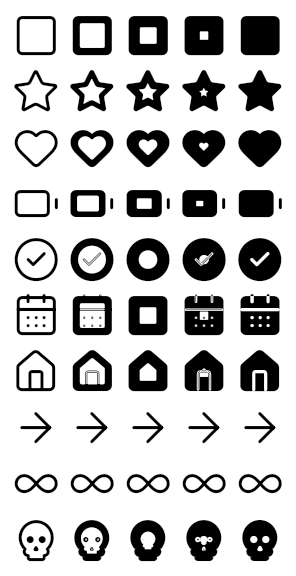

# variable_font_generator

A Dart tool that turns a directory of SVG icons into a **variable** OpenType
icon font, and writes the Flutter bindings for it.

The generated font responds to the four axes Flutter's `Icon` widget already
drives — `fill`, `weight`, `grade` and `opticalSize` — so one file covers what
would otherwise be a family of them.

<!-- The picture below is the fill axis running from 0 to 1, drawn by Flutter
     from the generated font. It is a checked-in golden test. -->


## Layout

| | |
| --- | --- |
| [`packages/variable_font_generator`](packages/variable_font_generator) | the tool, as a pure Dart package |
| [`packages/lucide_variable_icons`](packages/lucide_variable_icons) | 45 Lucide icons built by it, with Flutter golden tests |
| [`tool/verify_font.py`](tool/verify_font.py) | checks a font against fontTools, FreeType, resvg, HarfBuzz and the OpenType Sanitizer |

Start with the [package README](packages/variable_font_generator/README.md) —
it covers installation, the command line, how the axes are realised, and the
limitations.

## Quick start

```sh
cd packages/variable_font_generator
dart pub get
dart run bin/variable_font_generator.dart build ../../my-icons \
  --output ../../build/my_icons --family MyIcons
```

## Working on this repository

```sh
# the generator: unit tests, round-trip tests and image comparisons
cd packages/variable_font_generator && dart pub get && dart test

# the Flutter package: golden tests rendered by the real engine
cd packages/lucide_variable_icons && flutter pub get && flutter test

# rebuild the checked-in Flutter package after changing the generator
./tool/generate_lucide_package.sh

# check a font against four independent implementations
pip install -r tool/requirements.txt
python3 tool/verify_font.py \
  --icons packages/variable_font_generator/test/fixtures/lucide \
  --font packages/lucide_variable_icons/lib/fonts/LucideVariable.ttf \
  --codepoints packages/lucide_variable_icons/codepoints.json
```

`packages/lucide_variable_icons` is generated and checked in, because the golden
tests need something to render. A test in the generator package fails if it
drifts from what the generator would produce today.

## Licence

The tool is MIT licensed; see [LICENSE](LICENSE).

The icons under `packages/variable_font_generator/test/fixtures/lucide` are from
[Lucide](https://lucide.dev) and are ISC licensed; their licence is kept beside
them. `packages/lucide_variable_icons` is built from those, and carries the same
licence.
